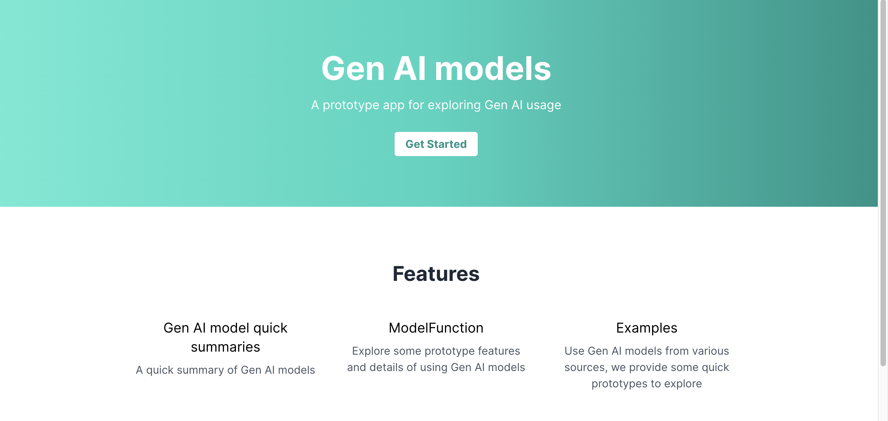
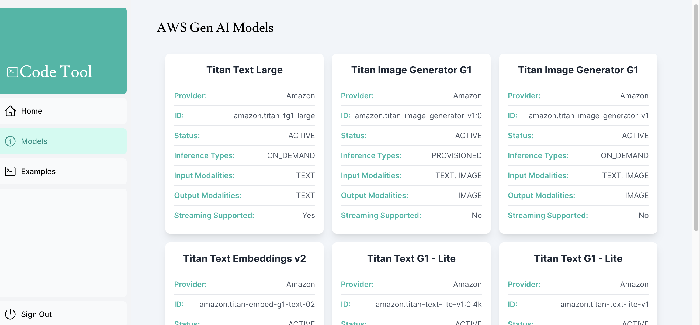
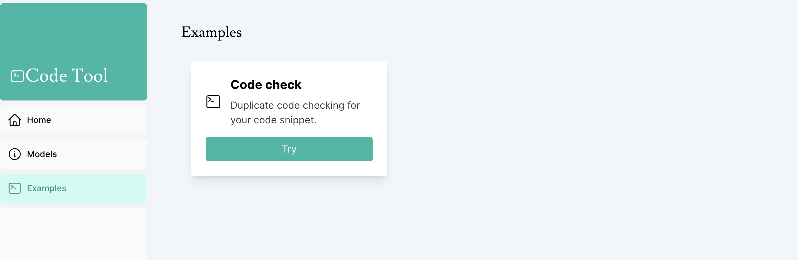
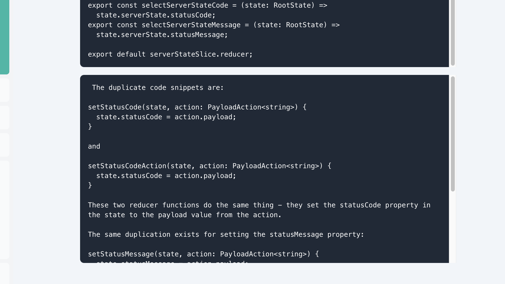

# Getting Started

To install dependencies: `npm install`

**First, configure the aws access key and aws access token in `.env.local`** as the following format:

```env
AWS_ACCESS_KEY_ID=YOUR_ACCESS_KEY_ID
AWS_SECRET_ACCESS_KEY=YOUR_SECRET_ACCESS_KEY

<!-- For key usage on client components, not recommended and needs to be refactored -->
NEXT_PUBLIC_AWS_ACCESS_KEY_ID=YOUR_ACCESS_KEY_ID
NEXT_PUBLIC_AWS_SECRET_ACCESS_KEY=YOUR_SECRET_ACCESS_KEY
```

Then, run the development server:

```bash
npm run dev
```

Open [http://localhost:3000](http://localhost:3000) with your browser to see the result.

You can start editing the page by modifying `app/page.tsx`. The page auto-updates as you edit the file.

This project uses [`next/font`](https://nextjs.org/docs/basic-features/font-optimization) to automatically optimize and load Inter, a custom Google Font.

## Prototype landing page



## Gen AI model list

So far only AWS bedrock models are integrated and listed. But considering to include more models(google models, OpenAI models, etc) and introduce clickable feature for each model card that links to model details content when clicked.



## Click examples to check out code tools

As a quick prototype, a claude2 model integration is provided for duplicate code checking. The feature can be extended to use selected modelss



A quick execution result is as below:


